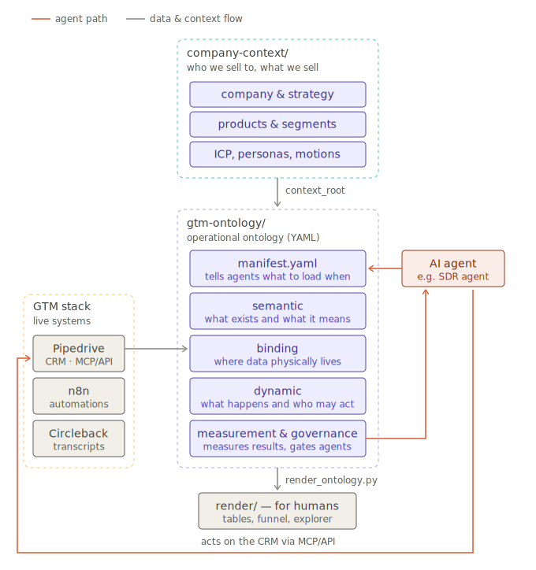

# CRM Ontology agent skill for Pipedrive, HubSpot, Attio, Salesforce

Make your CRM understandable for AI agents.

A schema export tells an agent that a dropdown called `lifecycle_stage` exists with
values Lead / MQL / SQL. It doesn't tell it when a lead actually becomes an SQL, which
n8n workflow writes the AI summary field and from what prompt, or that moving a deal to
"Demo" fires an automation that creates a task. And no CRM export will ever tell it who
you sell to, what you say to which persona, or which claims about your product are
approved. That knowledge sits in people's heads, and it breaks the moment an agent
starts writing to your CRM.

This repo is a method for writing it down once, in a form that works for three
audiences at the same time: your sales team and leadership (rendered tables and funnel
diagrams, no YAML), AI agents (small, indexed artifacts), and the CRM API (field keys,
enum maps, stage ids). If you run a CRM as an admin or own the sales process, this is
for you.

That context also changes the analysis you can do. An agent can read your CRM data
not only quantitatively (conversion, velocity, pipeline value) but qualitatively: do
deals actually meet the criteria of their stage, do the ones you win match your ICP,
what the lost ones have in common.

## How it works

<picture>
  <source media="(prefers-color-scheme: dark)" srcset="docs/assets/architecture-dark.svg">
  
</picture>

A static context layer plus four ontology layers. **Company context** is who you sell
to and why: strategy, segments, ICPs, personas, positioning, messaging, motions.
The tree is navigated by manifests and `load_when` hints, so an agent loads only
what the task needs. **Semantic** is what exists in the business: objects, fields with meaning,
conditions behind every dropdown value. **Binding** is where the data physically lives:
systems, field-key mappings, cross-system identity. **Dynamic** is what happens:
pipelines as state machines, existing automations with fingerprints so agents can tell
who wrote a value, and action contracts defining what an agent may do, in what order,
with what approvals. Actions group into loops, each with a human steward. **Measurement &
governance** is KPIs defined in ontology terms, a permission ladder for agents
(read-only → approve-each-write → autonomous-with-log, promotion earned per loop), and
hard limits.

Both trees are small YAML artifacts behind manifest indexes. An agent reads the index
first, then loads only the artifacts its task needs: progressive disclosure instead
of dumping the whole ontology into its context window.

Everything the systems can't tell you gets collected in a structured interview. Every
statement carries its provenance (`discovered` / `inferred` / `declared` / `learned`)
and a status: agents never act on drafts.

## What happens without it

An agent working in a CRM without this context doesn't fail loudly. It fails quietly:

- It moves deals to stages whose entry criteria they don't meet, and your forecast is
  built on those stages.
- It overwrites fields that an automation or another AI fills, the automation writes
  them back, and nobody notices for weeks.
- It triggers workflows it doesn't know exist: a stage change that silently creates
  tasks, sends emails, notifies people.
- It qualifies leads on firmographics alone, mails the wrong segment with invented
  messaging, and treats every contact as your ICP.
- It acts with no permission boundaries. Nothing says which actions need approval,
  which fields it may write, or where it must stop and ask.

None of this is the model's fault. The knowledge it needed was never written down in a
form it could load.

## What you build

Two linked trees of small YAML/Markdown artifacts, each a single source of truth:

**Company context** (`company-context/`) is the static business layer: what the company
sells, to whom, and why. Product groups, segments, ICPs, personas, buying context,
positioning, value propositions, messaging, GTM motions. Built first, with the
**company-context-builder** skill, from your materials, web research, and Closed Won
analysis. This is what stops an agent from inventing positioning or mailing the wrong
audience.

**GTM ontology** (`gtm-ontology/`) is the operational layer: what exists in the CRM and
what each value means, where the data physically lives, what already happens (pipelines
as state machines, automations with data fingerprints), and what agents may do (action
contracts, approval gates, a permission ladder). Built second, with the
**gtm-ontology-builder** skill. The ontology links to the context tree, never the other
way around.

## What's inside

| Folder | What it is |
|---|---|
| `skills/gtm-ontology-builder/` | Source for the **gtm-ontology-builder** skill. Install it in Claude, say "map my CRM" and it interviews you, introspects the CRM through MCP or API, and builds the ontology folder with you. |
| `skills/company-context-builder/` | Source for the **company-context-builder** skill, which builds the company, market, audience, product, positioning, messaging, and GTM context used by the ontology. |
| `gtm-ontology/` | A complete, validated example: fictional B2B SaaS on Pipedrive. Pipeline with entry/exit criteria, AI-filled fields with their prompt, 3 automations with data fingerprints, agent actions, KPIs. Linked to `company-context/` via `context_root`. This is exactly what the skill produces. |
| `company-context/` | A worked example of the static company-context tree: company facts, per-product-group segments, ICPs, personas, buying context, positioning, value propositions, messaging, and GTM motions. Built with **company-context-builder** and referenced from the ontology (`product-group:` / `gtm-motion:` refs). |
| `docs/` | The method: the layer model, a 7-phase process with interview question banks, a format spec for every artifact, CRM type mappings, extension and anti-pattern notes. |
| `schemas/` | JSON Schema for each artifact type: validate everything, trust nothing. |
| `templates/` | Commented starter files. |

## Install & quickstart

Pick an install path:

As a **Codex plugin**:

```sh
codex plugin marketplace add zawlodzki/GTM-ontology-framework
codex plugin add gtm-ontology-builder@personal
```

Start a new Codex task after installation so it picks up the plugin and its skills.

As a **Claude Code plugin**:

```
/plugin marketplace add zawlodzki/GTM-ontology-framework
/plugin install gtm-ontology-builder@gtm-ontology-framework
```

As **standalone skills with `npx skills`**:

```sh
npx skills add zawlodzki/GTM-ontology-framework --skill gtm-ontology-builder
npx skills add zawlodzki/GTM-ontology-framework --skill company-context-builder
```

Or grab `gtm-ontology-builder.skill` and `company-context-builder.skill` from this repo
and add them to Claude (Cowork or Claude Code), or copy the folders under `skills/`
into your skills folder. Every path is self-contained: the skills bundle the renderer,
validators, JSON schemas, and the complete worked example.

Then:

1. Connect your CRM. An MCP server is easiest, an API token works too. For platform
   CRMs (Salesforce, HubSpot) the skill scopes itself to the CRM module: Sales Cloud
   objects, not the whole platform.
2. Say: *"Build my company context."* The **company-context-builder** skill inventories
   your materials, researches the company and competitors, analyzes Closed Won deals,
   and writes the `company-context/` tree. You confirm every artifact before it counts.
   For web research it prefers the Exa MCP when connected. Not required, but it gives
   the best results.
3. Say: *"Build an ontology of my CRM."* The **gtm-ontology-builder** skill runs the
   phases, asks before it writes, links the ontology to your context tree, and ends
   with a `gtm-ontology/` folder in your repo plus an entry in your root `CLAUDE.md`
   so every future agent knows where to look.

Before running anything, open `gtm-ontology/render/explorer.html` from the example:
funnel, business logic per stage, actions, automations and the reference graph, all
in one file. That's the end state you're building toward.

## Why this exists

I implement CRMs for a living. On every project the same process knowledge had to be
written three times: a table for the sales team, context for AI agents, configuration
for the API. Three copies, three places to drift apart. This framework keeps one source
of truth in YAML and renders the rest. The examples in `gtm-ontology/` and
`company-context/` are small on purpose: read them in ten minutes, then decide if the
method fits your stack.

## License

MIT. Use it, change it, ship it; just keep the copyright notice.

## Work with me

Want to talk about AI in B2B sales, or about implementing and optimizing a CRM?
grzesiek@zawlodzki.pl · [zawlodzki.pl](https://zawlodzki.pl)
