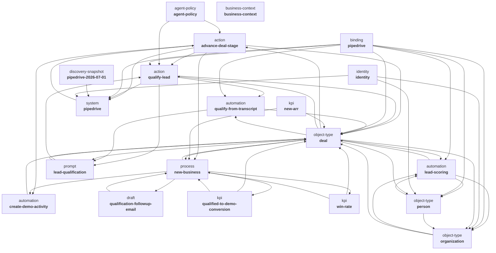

# Artifact reference graph

```mermaid
flowchart TD
  action_advance_deal_stage["action<br/><b>advance-deal-stage</b>"]
  action_qualify_lead["action<br/><b>qualify-lead</b>"]
  agent_policy_agent_policy["agent-policy<br/><b>agent-policy</b>"]
  automation_create_demo_activity["automation<br/><b>create-demo-activity</b>"]
  automation_lead_scoring["automation<br/><b>lead-scoring</b>"]
  automation_qualify_from_transcript["automation<br/><b>qualify-from-transcript</b>"]
  binding_pipedrive["binding<br/><b>pipedrive</b>"]
  business_context_business_context["business-context<br/><b>business-context</b>"]
  discovery_snapshot_pipedrive_2026_07_01["discovery-snapshot<br/><b>pipedrive-2026-07-01</b>"]
  draft_qualification_followup_email["draft<br/><b>qualification-followup-email</b>"]
  identity_identity["identity<br/><b>identity</b>"]
  kpi_new_arr["kpi<br/><b>new-arr</b>"]
  kpi_qualified_to_demo_conversion["kpi<br/><b>qualified-to-demo-conversion</b>"]
  kpi_win_rate["kpi<br/><b>win-rate</b>"]
  object_type_deal["object-type<br/><b>deal</b>"]
  object_type_organization["object-type<br/><b>organization</b>"]
  object_type_person["object-type<br/><b>person</b>"]
  process_new_business["process<br/><b>new-business</b>"]
  prompt_lead_qualification["prompt<br/><b>lead-qualification</b>"]
  system_pipedrive["system<br/><b>pipedrive</b>"]
  action_advance_deal_stage --> action_qualify_lead
  action_advance_deal_stage --> automation_create_demo_activity
  action_advance_deal_stage --> object_type_deal
  action_advance_deal_stage --> process_new_business
  action_advance_deal_stage --> system_pipedrive
  action_qualify_lead --> automation_qualify_from_transcript
  action_qualify_lead --> object_type_deal
  action_qualify_lead --> prompt_lead_qualification
  action_qualify_lead --> system_pipedrive
  agent_policy_agent_policy --> action_advance_deal_stage
  agent_policy_agent_policy --> action_qualify_lead
  automation_create_demo_activity --> object_type_deal
  automation_lead_scoring --> object_type_deal
  automation_lead_scoring --> object_type_organization
  automation_lead_scoring --> object_type_person
  automation_qualify_from_transcript --> object_type_deal
  automation_qualify_from_transcript --> prompt_lead_qualification
  binding_pipedrive --> action_qualify_lead
  binding_pipedrive --> automation_lead_scoring
  binding_pipedrive --> automation_qualify_from_transcript
  binding_pipedrive --> object_type_deal
  binding_pipedrive --> object_type_organization
  binding_pipedrive --> object_type_person
  binding_pipedrive --> system_pipedrive
  discovery_snapshot_pipedrive_2026_07_01 --> system_pipedrive
  draft_qualification_followup_email --> process_new_business
  identity_identity --> object_type_organization
  identity_identity --> object_type_person
  identity_identity --> system_pipedrive
  kpi_new_arr --> object_type_deal
  kpi_new_arr --> process_new_business
  kpi_qualified_to_demo_conversion --> object_type_deal
  kpi_qualified_to_demo_conversion --> process_new_business
  kpi_win_rate --> object_type_deal
  kpi_win_rate --> process_new_business
  object_type_deal --> action_advance_deal_stage
  object_type_deal --> action_qualify_lead
  object_type_deal --> automation_lead_scoring
  object_type_deal --> automation_qualify_from_transcript
  object_type_deal --> object_type_organization
  object_type_deal --> object_type_person
  object_type_deal --> process_new_business
  object_type_deal --> prompt_lead_qualification
  object_type_organization --> automation_lead_scoring
  object_type_organization --> object_type_deal
  object_type_person --> automation_lead_scoring
  object_type_person --> object_type_organization
  process_new_business --> automation_create_demo_activity
  process_new_business --> draft_qualification_followup_email
  process_new_business --> kpi_qualified_to_demo_conversion
  process_new_business --> kpi_win_rate
  process_new_business --> object_type_deal
  prompt_lead_qualification --> action_qualify_lead
  prompt_lead_qualification --> object_type_deal
  system_pipedrive --> action_advance_deal_stage
```

*Generated from ontology `acme-analytics` v1.1.0 (2026-07-06) — do not hand-edit.*
