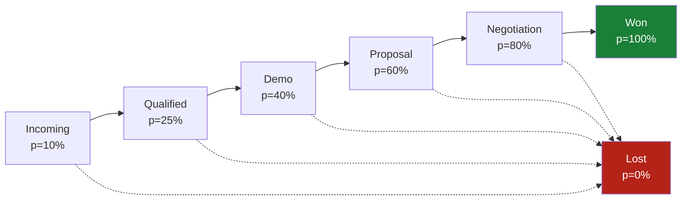

# New Business Pipeline

From accepted lead to signed contract. Runs on Pipedrive pipeline 'New Business'; terminal won/lost map to Pipedrive deal status (see bindings notes).

*Product groups: commerce-analytics · GTM motions: commerce-analytics-inbound, commerce-analytics-outbound*

| | Incoming | Qualified | Demo | Proposal | Negotiation | Won | Lost |
|---|---|---|---|---|---|---|---|
| **Definition** | A raw opportunity accepted into the pipeline, not yet human-verified. | Fit and intent verified by a human; worth AE time. | AE actively demonstrating the product to the buying group. | Formal proposal sent; amount now equals proposal value. | Commercial/legal negotiation of an accepted-in-principle proposal. | Contract signed by both parties and stored on the deal. | Deal closed without signature; reason recorded in a note. |
| **Entry criteria** | Person is MQL (inbound) or replied positively to sequence (outbound); Organization identified with domain | ICP fit confirmed; Qualification call held or scheduled with the buyer persona; Person marked SQL | All Qualified exit criteria met; Demo meeting scheduled with buyer persona present | Proposal document sent and logged on the deal | Prospect engaged on terms (redlines, procurement, security review) | Signed contract file attached to the deal | Loss reason recorded (price/competitor/no-decision/disqualified) |
| **Exit criteria** | SDR verified ICP fit and reached the person | Budget confirmed within plan range; AI qualification available with supporting score | Demo held; next step agreed in writing | Prospect responded to proposal (accept/negotiate) | Final terms agreed by both sides |  |  |
| **NOT enough (bad examples)** |  | Prospect said 'looks interesting' on a cold call; no qualification call held; Budget assumed from company size, never stated by the prospect; ai_qualification_score >= 70 alone, without budget confirmation |  |  |  |  |  |
| **Customer verifier** |  | Prospect booked the demo slot themselves via the calendar link |  |  |  |  |  |
| **Probability** | 10% | 25% | 40% | 60% | 80% | 100% | 0% |
| **Required fields** | title, source_channel | amount, expected_close_date | amount, expected_close_date | amount, expected_close_date |  |  |  |
| **Mandatory tasks** |  | Hold qualification call; Confirm budget range |  |  |  |  |  |
| **SLA (target / rotting)** | 2 / 3 | 7 / 14 | 14 / 21 | 7 / 14 | 21 / 30 |  |  |
| **Owner** | SDR | SDR | AE | AE | AE |  |  |
| **Automations** |  |  | create-demo-activity |  |  |  |  |
| **KPIs** | qualified-to-demo-conversion | qualified-to-demo-conversion |  |  |  |  |  |
| **Loss reasons** |  | No budget; No decision power; Bad timing |  | Too expensive; Chose competitor |  |  |  |
| **Tips** |  | Ask about the decision process before showing pricing. |  |  |  |  |  |

*Generated from ontology `acme-analytics` v1.5.0 (2026-07-16), do not hand-edit.*
